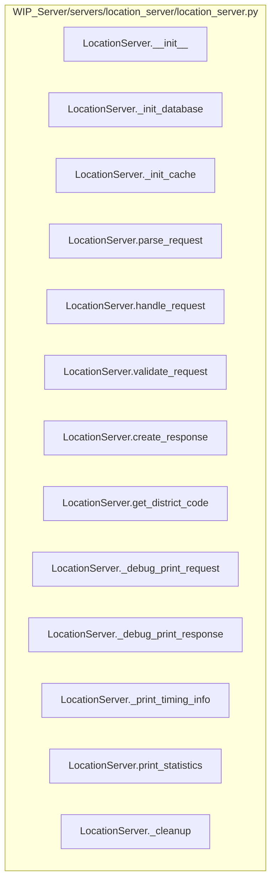

```mermaid
graph TD
subgraph WIP_Server_servers_location_server_location_server_py["WIP_Server/servers/location_server/location_server.py"]
  WIP_Server_servers_location_server_location_server_py:LocationServer___init__["LocationServer.__init__"]
  WIP_Server_servers_location_server_location_server_py:LocationServer__init_database["LocationServer._init_database"]
  WIP_Server_servers_location_server_location_server_py:LocationServer__init_cache["LocationServer._init_cache"]
  WIP_Server_servers_location_server_location_server_py:LocationServer_parse_request["LocationServer.parse_request"]
  WIP_Server_servers_location_server_location_server_py:LocationServer_handle_request["LocationServer.handle_request"]
  WIP_Server_servers_location_server_location_server_py:LocationServer_validate_request["LocationServer.validate_request"]
  WIP_Server_servers_location_server_location_server_py:LocationServer_create_response["LocationServer.create_response"]
  WIP_Server_servers_location_server_location_server_py:LocationServer_get_district_code["LocationServer.get_district_code"]
  WIP_Server_servers_location_server_location_server_py:LocationServer__debug_print_request["LocationServer._debug_print_request"]
  WIP_Server_servers_location_server_location_server_py:LocationServer__debug_print_response["LocationServer._debug_print_response"]
  WIP_Server_servers_location_server_location_server_py:LocationServer__print_timing_info["LocationServer._print_timing_info"]
  WIP_Server_servers_location_server_location_server_py:LocationServer_print_statistics["LocationServer.print_statistics"]
  WIP_Server_servers_location_server_location_server_py:LocationServer__cleanup["LocationServer._cleanup"]
end
```
