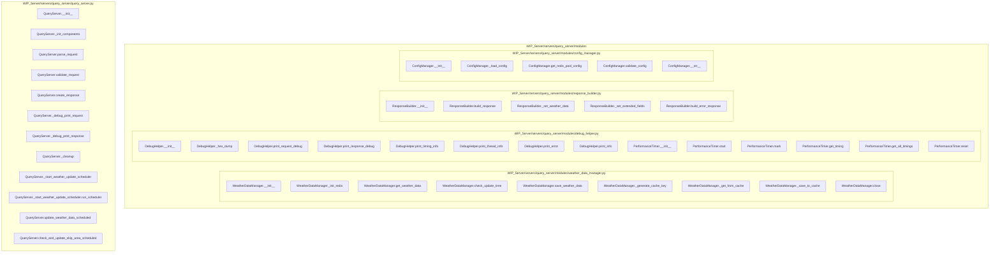

```mermaid
graph TD
subgraph WIP_Server_servers_query_server_modules["WIP_Server/servers/query_server/modules"]
  subgraph WIP_Server_servers_query_server_modules_weather_data_manager_py["WIP_Server/servers/query_server/modules/weather_data_manager.py"]
    WIP_Server_servers_query_server_modules_weather_data_manager_py:WeatherDataManager___init__["WeatherDataManager.__init__"]
    WIP_Server_servers_query_server_modules_weather_data_manager_py:WeatherDataManager__init_redis["WeatherDataManager._init_redis"]
    WIP_Server_servers_query_server_modules_weather_data_manager_py:WeatherDataManager_get_weather_data["WeatherDataManager.get_weather_data"]
    WIP_Server_servers_query_server_modules_weather_data_manager_py:WeatherDataManager_check_update_time["WeatherDataManager.check_update_time"]
    WIP_Server_servers_query_server_modules_weather_data_manager_py:WeatherDataManager_save_weather_data["WeatherDataManager.save_weather_data"]
    WIP_Server_servers_query_server_modules_weather_data_manager_py:WeatherDataManager__generate_cache_key["WeatherDataManager._generate_cache_key"]
    WIP_Server_servers_query_server_modules_weather_data_manager_py:WeatherDataManager__get_from_cache["WeatherDataManager._get_from_cache"]
    WIP_Server_servers_query_server_modules_weather_data_manager_py:WeatherDataManager__save_to_cache["WeatherDataManager._save_to_cache"]
    WIP_Server_servers_query_server_modules_weather_data_manager_py:WeatherDataManager_close["WeatherDataManager.close"]
  end
  subgraph WIP_Server_servers_query_server_modules_debug_helper_py["WIP_Server/servers/query_server/modules/debug_helper.py"]
    WIP_Server_servers_query_server_modules_debug_helper_py:DebugHelper___init__["DebugHelper.__init__"]
    WIP_Server_servers_query_server_modules_debug_helper_py:DebugHelper__hex_dump["DebugHelper._hex_dump"]
    WIP_Server_servers_query_server_modules_debug_helper_py:DebugHelper_print_request_debug["DebugHelper.print_request_debug"]
    WIP_Server_servers_query_server_modules_debug_helper_py:DebugHelper_print_response_debug["DebugHelper.print_response_debug"]
    WIP_Server_servers_query_server_modules_debug_helper_py:DebugHelper_print_timing_info["DebugHelper.print_timing_info"]
    WIP_Server_servers_query_server_modules_debug_helper_py:DebugHelper_print_thread_info["DebugHelper.print_thread_info"]
    WIP_Server_servers_query_server_modules_debug_helper_py:DebugHelper_print_error["DebugHelper.print_error"]
    WIP_Server_servers_query_server_modules_debug_helper_py:DebugHelper_print_info["DebugHelper.print_info"]
    WIP_Server_servers_query_server_modules_debug_helper_py:PerformanceTimer___init__["PerformanceTimer.__init__"]
    WIP_Server_servers_query_server_modules_debug_helper_py:PerformanceTimer_start["PerformanceTimer.start"]
    WIP_Server_servers_query_server_modules_debug_helper_py:PerformanceTimer_mark["PerformanceTimer.mark"]
    WIP_Server_servers_query_server_modules_debug_helper_py:PerformanceTimer_get_timing["PerformanceTimer.get_timing"]
    WIP_Server_servers_query_server_modules_debug_helper_py:PerformanceTimer_get_all_timings["PerformanceTimer.get_all_timings"]
    WIP_Server_servers_query_server_modules_debug_helper_py:PerformanceTimer_reset["PerformanceTimer.reset"]
  end
  subgraph WIP_Server_servers_query_server_modules_response_builder_py["WIP_Server/servers/query_server/modules/response_builder.py"]
    WIP_Server_servers_query_server_modules_response_builder_py:ResponseBuilder___init__["ResponseBuilder.__init__"]
    WIP_Server_servers_query_server_modules_response_builder_py:ResponseBuilder_build_response["ResponseBuilder.build_response"]
    WIP_Server_servers_query_server_modules_response_builder_py:ResponseBuilder__set_weather_data["ResponseBuilder._set_weather_data"]
    WIP_Server_servers_query_server_modules_response_builder_py:ResponseBuilder__set_extended_fields["ResponseBuilder._set_extended_fields"]
    WIP_Server_servers_query_server_modules_response_builder_py:ResponseBuilder_build_error_response["ResponseBuilder.build_error_response"]
  end
  subgraph WIP_Server_servers_query_server_modules_config_manager_py["WIP_Server/servers/query_server/modules/config_manager.py"]
    WIP_Server_servers_query_server_modules_config_manager_py:ConfigManager___init__["ConfigManager.__init__"]
    WIP_Server_servers_query_server_modules_config_manager_py:ConfigManager__load_config["ConfigManager._load_config"]
    WIP_Server_servers_query_server_modules_config_manager_py:ConfigManager_get_redis_pool_config["ConfigManager.get_redis_pool_config"]
    WIP_Server_servers_query_server_modules_config_manager_py:ConfigManager_validate_config["ConfigManager.validate_config"]
    WIP_Server_servers_query_server_modules_config_manager_py:ConfigManager___str__["ConfigManager.__str__"]
  end
end
subgraph WIP_Server_servers_query_server_query_server_py["WIP_Server/servers/query_server/query_server.py"]
  WIP_Server_servers_query_server_query_server_py:QueryServer___init__["QueryServer.__init__"]
  WIP_Server_servers_query_server_query_server_py:QueryServer__init_components["QueryServer._init_components"]
  WIP_Server_servers_query_server_query_server_py:QueryServer_parse_request["QueryServer.parse_request"]
  WIP_Server_servers_query_server_query_server_py:QueryServer_validate_request["QueryServer.validate_request"]
  WIP_Server_servers_query_server_query_server_py:QueryServer_create_response["QueryServer.create_response"]
  WIP_Server_servers_query_server_query_server_py:QueryServer__debug_print_request["QueryServer._debug_print_request"]
  WIP_Server_servers_query_server_query_server_py:QueryServer__debug_print_response["QueryServer._debug_print_response"]
  WIP_Server_servers_query_server_query_server_py:QueryServer__cleanup["QueryServer._cleanup"]
  WIP_Server_servers_query_server_query_server_py:QueryServer__start_weather_update_scheduler["QueryServer._start_weather_update_scheduler"]
  WIP_Server_servers_query_server_query_server_py:QueryServer__start_weather_update_scheduler_run_scheduler["QueryServer._start_weather_update_scheduler.run_scheduler"]
  WIP_Server_servers_query_server_query_server_py:QueryServer_update_weather_data_scheduled["QueryServer.update_weather_data_scheduled"]
  WIP_Server_servers_query_server_query_server_py:QueryServer_check_and_update_skip_area_scheduled["QueryServer.check_and_update_skip_area_scheduled"]
end
```
