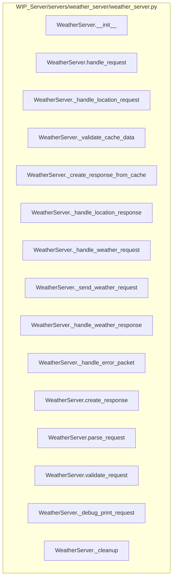

```mermaid
graph TD
subgraph WIP_Server_servers_weather_server_weather_server_py["WIP_Server/servers/weather_server/weather_server.py"]
  WIP_Server_servers_weather_server_weather_server_py:WeatherServer___init__["WeatherServer.__init__"]
  WIP_Server_servers_weather_server_weather_server_py:WeatherServer_handle_request["WeatherServer.handle_request"]
  WIP_Server_servers_weather_server_weather_server_py:WeatherServer__handle_location_request["WeatherServer._handle_location_request"]
  WIP_Server_servers_weather_server_weather_server_py:WeatherServer__validate_cache_data["WeatherServer._validate_cache_data"]
  WIP_Server_servers_weather_server_weather_server_py:WeatherServer__create_response_from_cache["WeatherServer._create_response_from_cache"]
  WIP_Server_servers_weather_server_weather_server_py:WeatherServer__handle_location_response["WeatherServer._handle_location_response"]
  WIP_Server_servers_weather_server_weather_server_py:WeatherServer__handle_weather_request["WeatherServer._handle_weather_request"]
  WIP_Server_servers_weather_server_weather_server_py:WeatherServer__send_weather_request["WeatherServer._send_weather_request"]
  WIP_Server_servers_weather_server_weather_server_py:WeatherServer__handle_weather_response["WeatherServer._handle_weather_response"]
  WIP_Server_servers_weather_server_weather_server_py:WeatherServer__handle_error_packet["WeatherServer._handle_error_packet"]
  WIP_Server_servers_weather_server_weather_server_py:WeatherServer_create_response["WeatherServer.create_response"]
  WIP_Server_servers_weather_server_weather_server_py:WeatherServer_parse_request["WeatherServer.parse_request"]
  WIP_Server_servers_weather_server_weather_server_py:WeatherServer_validate_request["WeatherServer.validate_request"]
  WIP_Server_servers_weather_server_weather_server_py:WeatherServer__debug_print_request["WeatherServer._debug_print_request"]
  WIP_Server_servers_weather_server_weather_server_py:WeatherServer__cleanup["WeatherServer._cleanup"]
end
```
