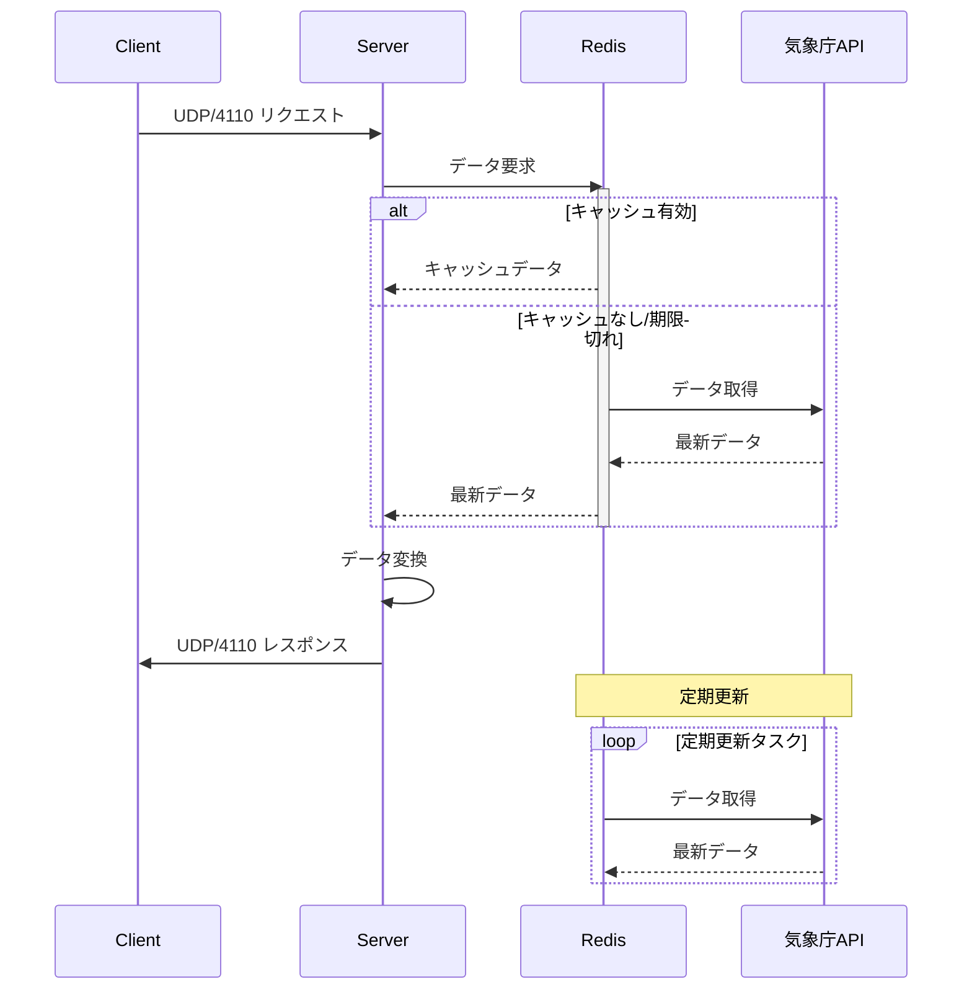
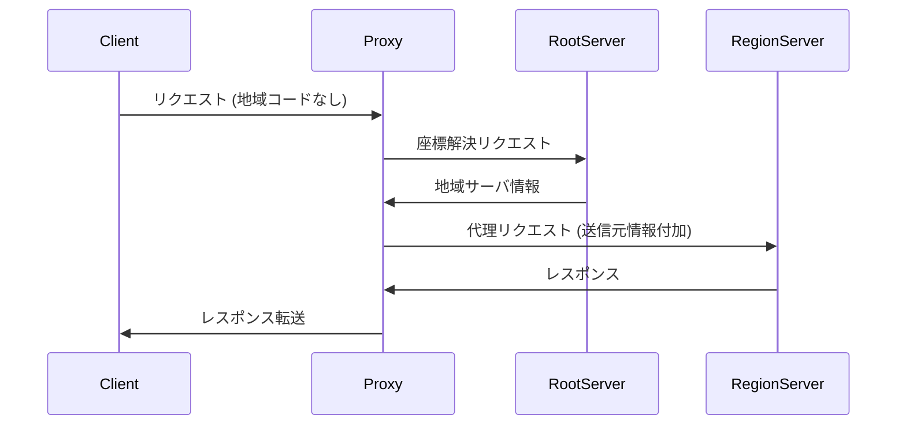
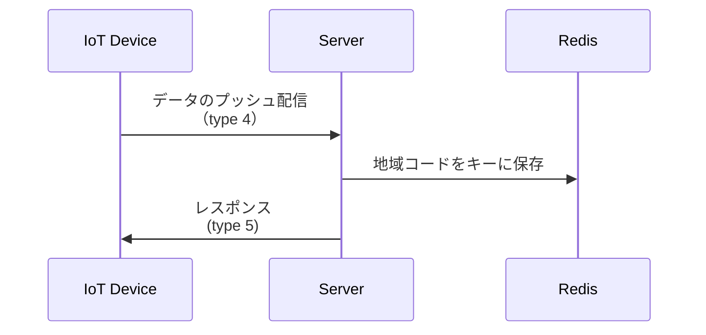

# weatherプロトコル (WIP) - 仕様書 & README

[](https://github.com/your-username/weather-protocol)

## 目次
1. [概要](#概要)
2. [情報の取得について](#情報の取得について)
3. [プロトコル詳細](#プロトコル詳細)
4. [サーバ・クライアントの動作](#サーバクライアントの動作)
5. [収集データの送信](#収集データの送信)
6. [キャッシュの仕様](#キャッシュの仕様)
7. [インストールと使用方法](#インストールと使用方法)
8. [開発者向け情報](#開発者向け情報)
9. [貢献方法](#貢献方法)
10. [ライセンス](#ライセンス)

## 概要
NTPをベースとした軽量気象情報プロトコルで、IoT機器向けに最適化されています。

**主な特徴:**
- ポート番号 UDP/4110を使用
- 気象庁の公開データをXML形式で取得し、バイナリ形式に変換
- リクエストに基づいたレスポンスデータのフィルタリング
- 最小限のデータサイズ（リクエスト/レスポンス共に48バイト程度）
- 分散サーバアーキテクチャ
- クライアント-サーバ間の1:1メッセージ交換

**技術スタック:**
- コアプロトコル: UDPベースのカスタムバイナリプロトコル
- データソース: 気象庁公開API
- 参照実装: Python 3.10+
- データストア: Redis

## 情報の取得について
### 気象情報
- **更新頻度**: 定期更新（毎日5, 11, 17時）
- **取得URL**: `https://www.jma.go.jp/bosai/forecast/data/forecast/{地域コード}.json`
- **地域コード**: [area.json](https://www.jma.go.jp/bosai/common/const/area.json) で定義

### 災害情報
- **注意報・警報**:
  - 定時更新: [regular.xml](https://www.data.jma.go.jp/developer/xml/feed/regular.xml)
  - 随時更新: [extra.xml](https://www.data.jma.go.jp/developer/xml/feed/extra.xml)
- **地震・噴火情報**: 
  - [eqvol.xml](https://www.data.jma.go.jp/developer/xml/feed/eqvol.xml)
  - 連続リクエスト時は更新チェックを省略可能

## プロトコル詳細
### 基本仕様
- NTPベースのアプリケーションプロトコル
- MAC/IP/UDP上で動作
- リクエスト/レスポンス共に48バイト程度にサイズ制限
- バイナリ形式で送受信

### パケット構造
```plaintext
 0                   1                   2                   3
 0 1 2 3 4 5 6 7 8 9 0 1 2 3 4 5 6 7 8 9 0 1 2 3 4 5 6 7 8 9 0 1
+-+-+-+-+-+-+-+-+-+-+-+-+-+-+-+-+-+-+-+-+-+-+-+-+-+-+-+-+-+-+-+-+
|  Ver  |        Packet ID      |T| Flags       |          Timestamp         |
+-+-+-+-+-+-+-+-+-+-+-+-+-+-+-+-+-+-+-+-+-+-+-+-+-+-+-+-+-+-+-+-+
|          Timestamp (cont)     |   Checksum    | Day |       Region Code    |
+-+-+-+-+-+-+-+-+-+-+-+-+-+-+-+-+-+-+-+-+-+-+-+-+-+-+-+-+-+-+-+-+
|        Region Code (cont)     |  Weather Code | Temp | Precip | Reserved |
+-+-+-+-+-+-+-+-+-+-+-+-+-+-+-+-+-+-+-+-+-+-+-+-+-+-+-+-+-+-+-+-+
|        Extended Field (variable length)                      |
+-+-+-+-+-+-+-+-+-+-+-+-+-+-+-+-+-+-+-+-+-+-+-+-+-+-+-+-+-+-+-+-+
```

### フィールド詳細
| フィールド       | サイズ   | 説明                                                                 |
|------------------|----------|----------------------------------------------------------------------|
| バージョン       | 4ビット  | プロトコルバージョン (0001 = v1)                                    |
| パケットID       | 12ビット | パケット識別子 (重複防止)                                            |
| Type             | 3ビット  | 000:座標解決Req, 001:座標解決Res, 010:Req, 011:Res, 111:Error       |
| フラグ           | 6ビット  | [天気,気温,降水確率,注意報警報,災害情報,拡張フィールド] 取得フラグ  |
| タイムスタンプ   | 32ビット | UNIX時間 (秒単位)                                                   |
| チェックサム     | 12ビット | パケット全体の誤り検出 (計算時は0埋め)                               |
| 時間指定         | 3ビット  | 0=当日, 1=翌日, 2=明後日, ...                                       |
| 地域コード       | 20ビット | 座標解決で取得した地域コード                                         |
| 天気コード       | 16ビット | [weather_code.json](weather_code.json) 参照 (レスポンスのみ)         |
| 気温             | 8ビット  | 2の補数形式 (℃単位) (レスポンスのみ)                                |
| 降水確率         | 8ビット  | 1%単位 (00000101=5%) (レスポンスのみ)                               |
| 予約フィールド   | 4ビット  | 将来使用のために予約                                                 |
| 拡張フィールド   | 可変長   | 追加データ格納用 (下記詳細)                                          |

### 拡張フィールド仕様
- バイナリデータ形式
- ヘッダ(16bit) + データ部の構造
- ヘッダ構成:
  - データ長(10bit): 8bit単位のデータ長 (最大65535バイト)
  - データ種別(6bit): 
    - `000001`: 注意報・警報
    - `000010`: 災害情報
    - `100001`: 緯度
    - `100010`: 経度
    - `101000`: 送信元IPアドレス (代理サーバ用)

**注意点:**
- 注意報・警報(`000001`)および災害情報(`000010`)のデータは、ヌル文字(`\0`)で区切られた文字列として格納されます

## サーバ・クライアントの動作
### WIPサーバ


### 代理サーバ


### クライアント
- 地域コード解決のため座標情報を拡張フィールドに含めてリクエスト
- 解決済み地域コードはローカルキャッシュに保存

## 収集データの送信
**仕様・特長**
- パケットタイプ4,5を使用
- クライアントからサーバへのプッシュ配信
  - クライアントのポート開放を不要に
IoT機器からのデータ収集フロー:


**データ仕様:**
- バージョン: 固定値
- パケットID: 通常仕様通り
- Type: 4,5 ( リクエスト/レスポンス)
- 地域コード: 機器設置地域
- Day: 0 (リアルタイムデータ)
- タイムスタンプ: 現在時刻
- 各種センサーデータ

## キャッシュの仕様
**クライアント側キャッシュ:**
- キャッシュ項目:
  - 経度
  - 緯度
  - 地域コード
  - 有効期限タイムスタンプ

**サーバ側キャッシュ:**
- 10分間キャッシュ
  - 地域コード
  - 気象情報等の取得データ
  - 取得時刻

**チェックフロー:**
  1. キャッシュに座標が存在するか確認
  2. 有効期限内ならキャッシュ使用
  3. 期限切れなら新規解決

## インストールと使用方法
### サーバセットアップ
```bash
# 依存関係インストール
pip install -r requirements.txt

# Redisサーバ起動 (別ターミナル)
redis-server

# メインサーバ起動
python WIP_Server/main.py
```

### クライアント実装例
```python
from client import WeatherClient

client = WeatherClient(server_ip="127.0.0.1")
response = client.get_weather(
    latitude=35.6895,
    longitude=139.6917,
    flags=["weather", "temperature"]
)
print(f"Current temperature: {response.temperature}°C")
```

### Dockerを使用したデプロイ
```bash
docker-compose up -d
```

## 開発者向け情報
### ディレクトリ構成
```
.
├── WIP_Server/          # サーバ実装
├── WIP_Client/          # クライアント実装
├── common/              # 共通ライブラリ
│   └── packet/          # パケット処理関連
├── docs/                # ドキュメント
├── tests/               # 単体テスト
└── requirements.txt     # 依存関係
```

### ビルドとテスト
```bash
# テスト実行
pytest tests/

# カバレッジ計測
pytest --cov=WIP_Server tests/

# 静的解析
flake8 WIP_Server/
mypy WIP_Server/
```

## 貢献方法
1. リポジトリをフォーク
2. フィーチャーブランチ作成 (`git checkout -b feat/new-feature`)
3. 変更をコミット (`git commit -am 'Add new feature'`)
4. プッシュ (`git push origin feat/new-feature`)
5. プルリクエスト作成

**コーディング規約:**
- PEP8に準拠
- Type Hintingを必須
- 公開APIはdocstring必須

## ライセンス
本プロジェクトは [MITライセンス](LICENSE) のもとで公開されています。

## 関連リソース
- [気象庁地域コード定義](https://www.jma.go.jp/bosai/common/const/area.json)
- [プロトコル仕様書](docs/protocol_spec.md)
- [天気コード定義](weather_code.json)
- [API設計ドキュメント](docs/api_design.md)

---
*最終更新: 2025年6月20日*
