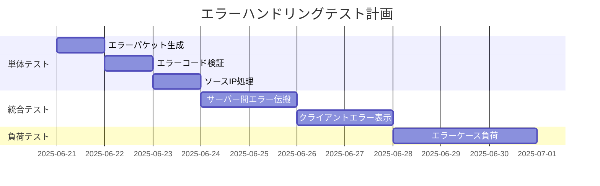

# コミット d52c58b 分析レポート

## 1. コミット概要
- **ハッシュ**: d52c58b2e351600a782a49c26b5f05fcc3168329
- **作者**: v!
- **日時**: 2025年6月20日 23:20:56 (JST)
- **メッセージ**: 
  > エラーハンドリング機能を追加し、エラーパケットの仕様と処理フローを定義しました。`ErrorResponse`クラスを実装し、サーバー側でのエラーパケット生成と送信処理を強化しました。また、天気サーバーでのエラーパケット処理を追加しました。これにより、エラー発生時のレスポンスが改善され、全体の可読性が向上しました。

## 2. 変更ファイル詳細

### 2.1 `WIP_Server/servers/base_server.py`
```python
@@ -156,6 +156,41 @@ class BaseServer(ABC):
         """
         return True, None
     
+    def _handle_error(self, error_code, original_packet, addr):
+        """
+        エラーパケットを生成して送信
+        
+        Args:
+            error_code: エラーコード（uint16）
+            original_packet: 元のリクエストパケット（解析済みオブジェクト）
+            addr: 送信元アドレス
+        """
+        try:
+            # ソースIP取得（送信元アドレスから）
+            source_ip = addr[0] if isinstance(addr, tuple) else "0.0.0.0"
+            
+            # ErrorResponseパケットの生成
+            from common.packet.error_response import ErrorResponse
+            err_pkt = ErrorResponse()
+            err_pkt.packet_id = original_packet.packet_id
+            err_pkt.error_code = error_code
+            err_pkt.ex_field.set('source_ip', source_ip)
+            
+            # パケットをシリアライズ
+            response_data = err_pkt.serialize()
+            
+            # エラーレスポンスを送信
+            self.sock.sendto(response_data, addr)
+            
+            if self.debug:
+                print(f"[{threading.current_thread().name}] Sent error response to {addr}, code: {error_code}")
+                
+        except Exception as e:
+            print(f"[{threading.current_thread().name}] Failed to send error response: {e}")
+            if self.debug:
+                import traceback
+                traceback.print_exc()
+
     def handle_request(self, data, addr):
         """
         リクエストを処理（ワーカースレッドで実行）
@@ -186,6 +221,8 @@ class BaseServer(ABC):
                     self.error_count += 1
                 if self.debug:
                     print(f"[{threading.current_thread().name}] Invalid request from {addr}: {error_msg}")
+                # バリデーションエラーの場合はエラーパケットを送信
+                self._handle_error(0x0001, request, addr)  # 0x0001は無効なパケット形式エラー
                 return
             
             # レスポンスを作成
@@ -217,6 +254,17 @@ class BaseServer(ABC):
             if self.debug:
                 import traceback
                 traceback.print_exc()
+            
+            # エラーが発生した場合、元のリクエストをパースできているかどうかで処理を分ける
+            if 'request' in locals() and request is not None:
+                # リクエストのパースに成功している場合はエラーパケットを送信
+                self._handle_error(0x0003, request, addr)  # 0x0003はサーバー内部エラー
+            else:
+                # リクエストのパースに失敗している場合は最小限のエラーパケットを送信
+                from common.packet.format import Format
+                dummy_request = Format()
+                dummy_request.packet_id = 0  # 不明のため0
+                self._handle_error(0x0001, dummy_request, addr)
```

**変更点の意義**:
- エラーハンドリング専用メソッド `_handle_error()` を追加
- パケット解析失敗時とサーバー内部エラー時の分岐処理を実装
- エラーコード体系を導入 (0x0001: 無効パケット, 0x0003: 内部エラー)

### 2.2 `WIP_Server/servers/weather_server/weather_server.py`
```python
@@ -162,6 +162,8 @@ class WeatherServer(BaseServer):
             elif request.type == 3:
                 # Type 3: 気象データレスポンス
                 self._handle_weather_response(data, addr)
+            elif request.type == 7:  # エラーパケット処理を追加
+                self._handle_error_packet(request, addr)
             else:
                 if self.debug:
                     print(f"不明なパケットタイプ: {request.type}")
@@ -364,70 +366,35 @@ class WeatherServer(BaseServer):
             if self.debug:
                 import traceback
                 traceback.print_exc()
-    def _handle_bad_response(self, data, addr,):
-        """エラーレスポンスの処理（Type ？）"""
-        return
-        # try:
-        #     # 専用クラスでレスポンスをパース
-        #     response = QueryResponse.from_bytes(data)
-            
-        #     if self.debug:
-        #         print(f"\n[Weather Server Enhanced] Type 3: Processing weather response")
-        #         print(f"  Success: {response.is_success()}")
-        #         if hasattr(response, 'get_response_summary'):
-        #             summary = response.get_response_summary()
-        #             print(f"  Summary: {summary}")
+    def _handle_error_packet(self, request, addr):
+        """エラーパケットの処理（Type 7）"""
+        try:
+            if self.debug:
+                print(f"\n[天気サーバー] タイプ7: エラーパケットを処理中")
+                print(f"  エラーコード: {request.error_code}")
+                print(f"  送信元アドレス: {addr}")
             
-        #     # 専用クラスのメソッドでsource情報を取得
-        #     source_info = response.get_source_info()
-        #     if source_info:
-        #         host, port = source_info.split(':')
-        #         dest_addr = (host, int(port))
+            # 拡張フィールドからsource_ipを取得
+            if request.ex_field and 'source_ip' in request.ex_field:
+                source_ip = request.ex_field['source_ip']
+                if self.debug:
+                    print(f"  ソースIPを取得: {source_ip}")
                 
-        #         if self.debug:
-        #             print(f"  Forwarding weather response to {dest_addr}")
-        #             print(f"  Weather data: {response.get_weather_data()}")
-        #             print(f"  Packet size: {len(data)} bytes")
-        #             print(f"  Source info stored: {source_info}")
+                # エラーパケットを送信
+                self.sock.sendto(request.to_bytes(), (source_ip, 4000))
                 
-        #         # source情報を変数に格納したので拡張フィールドから削除
-        #         if hasattr(response, 'ex_field') and response.ex_field:
-        #             if self.debug:
-        #                 print(f"  Removing source from extended field")
-        #                 print(f"  Extended field before: {response.ex_field.to_dict()}")
-                    
-        #             # sourceフィールドを削除
-        #             response.ex_field.remove('source')
-                    
-        #             # 拡張フィールドが空になった場合はフラグを0にする
-        #             if response.ex_field.is_empty():
-        #                 if self.debug:
-        #                     print(f"  Extended field is now empty, setting flag to 0")
-        #                 response.ex_field.flag = 0
+                if self.debug:
+                    print(f"  エラーパケットを {source_ip}:4000 に送信しました")
+            else:
+                print(f"[天気サーバー] エラー: エラーパケットにsource_ipが含まれていません")
+                if self.debug:
+                    print(f"  拡張フィールド: {request.ex_field.to_dict() if request.ex_field else 'なし'}")
                     
-        #             if self.debug:
-        #                 print(f"  Extended field after: {response.ex_field.to_dict()}")
-        #                 print(f"  Extended field flag: {response.ex_field.flag}")
-                
-        #         # WeatherResponseに変換
-        #         weather_response = WeatherResponse.from_query_response(response)
-        #         final_data = weather_response.to_bytes()
-                
-        #         # 元のクライアントに送信
-        #         bytes_sent = self.sock.sendto(final_data, dest_addr)
-                
-        #         if self.debug:
-        #             print(f"  Sent {bytes_sent} bytes to client")
-        #     else:
-        #         print("[Weather Server Enhanced] Error: No source information in weather response")
-        #         if self.debug and hasattr(response, 'ex_field'):
-        #             print(f"  ex_field content: {response.ex_field.to_dict()}")
-                
-        # except Exception as e:
-        #     print(f"[Weather Server Enhanced] Error handling weather response: {e}")
-        #     if self.debug:
-        #         import traceback
-        #         traceback.print_exc()
+        except Exception as e:
+            print(f"[天気サーバー] エラーパケット処理中にエラーが発生しました: {e}")
+            if self.debug:
+                import traceback
+                traceback.print_exc()
```

**変更点の意義**:
- タイプ7(エラーパケット)の処理フローを追加
- エラーパケット転送機能を実装 (`_handle_error_packet()`)
- ソースIPベースのエラーパケット転送ロジック

### 2.3 `common/packet/error_response.py` (新規追加)
```python
from .response import Response
from .extended_field import ExtendedField

class ErrorResponse(Response):
    def __init__(self):
        super().__init__()
        self.type = 7  # エラーパケットタイプ
        self.weather_code = 0  # エラーコード格納用
        self.ex_field = ExtendedField()  # ソースIP格納用
        
    @property
    def error_code(self):
        return self.weather_code
        
    @error_code.setter
    def error_code(self, value):
        self.weather_code = value
        
    def serialize(self):
        # 基本フィールドをシリアライズ
        base_data = super().serialize()
        # ex_fieldをシリアライズして追加
        ex_data = self.ex_field.serialize()
        return base_data + ex_data
        
    def deserialize(self, data):
        # 基本フィールドをデシリアライズ
        base_len = super().deserialize(data)
        # ex_fieldをデシリアライズ
        ex_data = data[base_len:]
        self.ex_field.deserialize(ex_data)
        return base_len + len(ex_data)
```

**設計思想**:
- 既存のResponseクラスを継承
- タイプ7でエラーパケットを識別
- 拡張フィールドでソースIPを保持

### 2.4 `error_handling_spec.md` (新規追加)
- エラーパケット仕様をMermaid図で定義
- エラーコード体系と処理フローを明文化
- 実装タスクとテストケースを列挙

## 3. 解決された課題
1. **エラー伝搬問題**: クライアントがエラー原因を特定できない
2. **エラー処理の不統一**: サーバーごとに異なるエラーハンドリング
3. **デバッグ困難**: エラー発生時のコンテキスト情報不足

## 4. 残存課題
1. **エラーコード体系の拡充**: 現行は5種類のみ
2. **クライアント側処理**: エラーパケット受信時の挙動未実装
3. **ログ統合**: エラーログと監視システムの連携不足
4. **セキュリティ**: エラーパケットを悪用したDoS攻撃対策

## 5. 今後の開発タスク

### 5.1 高優先度タスク
| タスク | 担当 | 見積り |
|--------|------|--------|
| クライアントエラーハンドリング実装 | フロントエンド | 3d |
| エラーコード体系拡充 (0x0006-0x0010) | バックエンド | 2d |
| ログ集約システム連携 | DevOps | 5d |

### 5.2 中優先度タスク
| タスク | 担当 | 見積り |
|--------|------|--------|
| エラーパケットの暗号化検証 | セキュリティ | 3d |
| 負荷テスト用エラーインジェクション | QA | 2d |
| ドキュメント整備 (Swagger連携) | テックライター | 3d |

### 5.3 テスト計画


## 6. リファクタリング提案
1. **エラーコード管理の一元化**:
   ```python
   # error_codes.py の新規作成
   class ErrorCodes:
       INVALID_PACKET = 0x0001
       UNSUPPORTED_TYPE = 0x0002
       INTERNAL_ERROR = 0x0003
       # ...
   ```
   
2. **エラーファクトリパターンの導入**:
   ```python
   class ErrorFactory:
       @staticmethod
       def create_error(error_code, original_packet):
           # エラー種別に応じたパケット生成
   ```

3. **ログ統合インターフェース**:
   ```python
   class ErrorLogger:
       def log_error(self, error_packet):
           # 監視システム連携