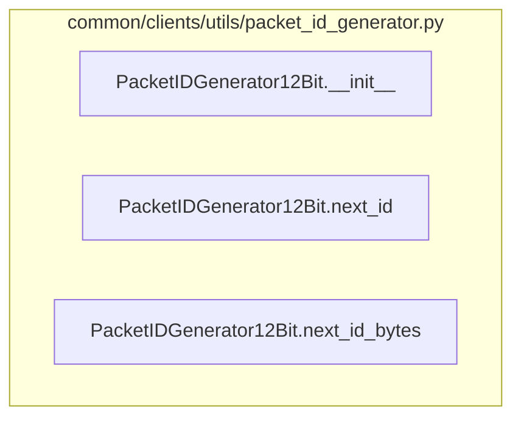

```mermaid
graph TD
subgraph common_clients_utils_packet_id_generator_py["common/clients/utils/packet_id_generator.py"]
  common_clients_utils_packet_id_generator_py:PacketIDGenerator12Bit___init__["PacketIDGenerator12Bit.__init__"]
  common_clients_utils_packet_id_generator_py:PacketIDGenerator12Bit_next_id["PacketIDGenerator12Bit.next_id"]
  common_clients_utils_packet_id_generator_py:PacketIDGenerator12Bit_next_id_bytes["PacketIDGenerator12Bit.next_id_bytes"]
end
```
