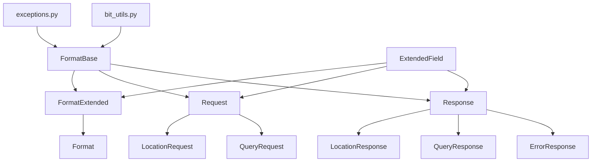

# common/packet モジュール概要

このドキュメントでは `common/packet` ディレクトリに含まれるモジュールの役割と
相互関係をまとめます。各モジュールがどのように関連し合うかをマーメイド図で視覚的
に示します。

## ディレクトリ構成

```
common/packet/
├── __init__.py
├── bit_utils.py
├── debug_extended_bits.py
├── error_response.py
├── exceptions.py
├── extended_field.py
├── format_base.py
├── format_extended.py
├── format.py
├── request.py
├── response.py
├── location_packet.py
├── query_packet.py
├── example_usage.py
├── test_checksum.py
├── test_specialized_packets.py
├── PACKET_STRUCTURE.md
└── README.md
```

## モジュール説明

- **exceptions.py**: パケット処理で使用する例外を定義します。
- **bit_utils.py**: ビット操作のユーティリティ関数群です。
- **extended_field.py**: 拡張フィールドの管理クラス `ExtendedField` を提供します。
- **format_base.py**: 共通ヘッダー部の基底実装です。ビット長や位置の計算を行います。
- **format_extended.py**: `FormatBase` を拡張し、`ExtendedField` を組み込んだ
  クラスを実装します。
- **format.py**: 最小限のパケット処理を提供する `Format` クラスです。
- **request.py** / **response.py**: 基本的なリクエスト／レスポンスパケットを実装します。
- **location_packet.py**, **query_packet.py**:
  上記 Request/Response を継承した用途別のパケットクラス群です。
- **error_response.py**: エラー情報を返す専用レスポンスです。
- **debug_extended_bits.py** / **example_usage.py** / **test_*.py**:
  デバッグや使用例、テストコードが含まれます。

## クラス間の関係



各 specialized パケットは Request/Response を継承しており、
`ExtendedField` を通じて可変長の追加データをやり取りします。
これらの基本クラスは `bit_utils.py` と `exceptions.py` に依存して
ビット操作とエラー処理を行います。

## 参考

詳細なパケット構造については [PACKET_STRUCTURE.md](./PACKET_STRUCTURE.md)
を参照してください。
