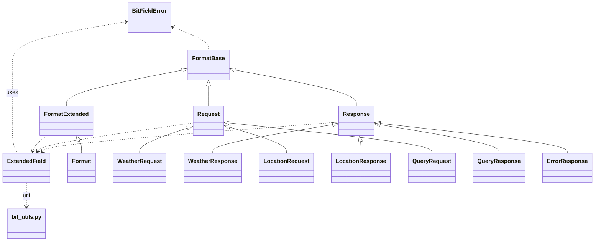

# common/packet モジュール階層概要

このドキュメントでは、`common/packet` ディレクトリに含まれるファイルの役割と
相互関係をまとめます。パケット実装の基礎クラスから専用パケットクラスまでの関連を
明確にし、Mermaid を用いてクラス階層を図示します。

## ディレクトリ構造

```text
common/packet/
├── __init__.py
├── PACKET_STRUCTURE.md
├── README.md
├── bit_utils.py
├── debug_extended_bits.py
├── error_response.py
├── exceptions.py
├── extended_field.py
├── format_base.py
├── format_extended.py
├── format.py
├── location_packet.py
├── query_packet.py
├── request.py
├── response.py
├── weather_packet.py
├── example_usage.py
├── test_checksum.py
└── test_specialized_packets.py
```

## 各ファイルの概要

| ファイル | 役割 |
|---------|--------------------------------------------------------------|
| `__init__.py` | パッケージ初期化と主要クラスの公開 |
| `PACKET_STRUCTURE.md` | パケットビット配置などの詳細仕様書 |
| `README.md` | パケットライブラリの使い方ガイド |
| `bit_utils.py` | ビット操作ユーティリティ関数群 |
| `debug_extended_bits.py` | 拡張フィールドのビット長を解析するデバッグツール |
| `error_response.py` | エラー用レスポンスパケット実装 |
| `exceptions.py` | `BitFieldError` などの例外定義 |
| `extended_field.py` | 拡張フィールドデータ管理クラス |
| `format_base.py` | パケット共通ヘッダーの基底クラス |
| `format_extended.py` | `FormatBase` に拡張フィールド処理を追加したクラス |
| `format.py` | フル機能を備えたパケットクラス (主に内部利用) |
| `location_packet.py` | 位置情報取得用 `LocationRequest/Response` |
| `query_packet.py` | 気象データ取得用 `QueryRequest/Response` |
| `request.py` | 基本的なリクエストパケット実装 |
| `response.py` | 基本的なレスポンスパケット実装 |
| `weather_packet.py` | エンドユーザー向け `WeatherRequest/Response` |
| `example_usage.py` | 専用クラスの使用例 |
| `test_checksum.py` | チェックサム計算テスト |
| `test_specialized_packets.py` | 各専用パケットの単体テスト |

## クラス階層と依存関係



上記の図は、基底クラスから専用パケットクラスまでの継承関係と、
`ExtendedField` や `BitFieldError` といった補助クラスとの依存関係を示しています。
`Format` は内部処理用の統合クラスで、`Request`/`Response` から派生した
`Weather*`・`Location*`・`Query*` 系のクラスが実際の通信で利用されます。

## 関連性まとめ

1. **共通基盤**
   - `bit_utils.py` と `exceptions.py` は、各クラスから参照される基礎ユーティリティ。
   - `extended_field.py` は可変長データ領域を扱い、`Request`/`Response`/`FormatExtended` が利用。
2. **基底クラス**
   - `FormatBase` が共通ヘッダーの処理を提供。これを継承して
     `FormatExtended`・`Request`・`Response` が実装されます。
   - `FormatExtended` は拡張フィールドを統合し、`Format` がそれを継承して完全な
     パケット表現を実現します。
3. **専用パケット**
   - `weather_packet.py`、`location_packet.py`、`query_packet.py` では
     `Request`/`Response` を継承した使いやすい高レベル API を提供します。
   - `error_response.py` はエラー通知専用のレスポンスクラスです。
4. **補助スクリプト**
   - `debug_extended_bits.py` や `example_usage.py` はデバッグ・サンプル用途です。
   - `test_checksum.py` と `test_specialized_packets.py` は動作確認のためのテスト群。

このように `common/packet` では、ビット演算ユーティリティから
エンドユーザー向けの高レベル API まで一貫して管理されており、
各モジュールが階層的かつ相互に連携することで WIP プロトコルの
パケット処理を支えています。
