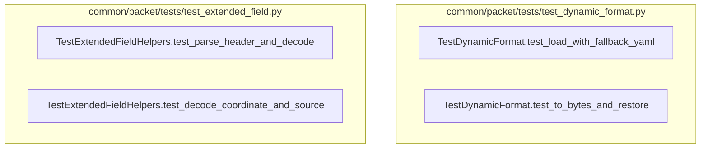

```mermaid
graph TD
subgraph common_packet_tests_test_dynamic_format_py["common/packet/tests/test_dynamic_format.py"]
  common_packet_tests_test_dynamic_format_py:TestDynamicFormat_test_load_with_fallback_yaml["TestDynamicFormat.test_load_with_fallback_yaml"]
  common_packet_tests_test_dynamic_format_py:TestDynamicFormat_test_to_bytes_and_restore["TestDynamicFormat.test_to_bytes_and_restore"]
end
subgraph common_packet_tests_test_extended_field_py["common/packet/tests/test_extended_field.py"]
  common_packet_tests_test_extended_field_py:TestExtendedFieldHelpers_test_parse_header_and_decode["TestExtendedFieldHelpers.test_parse_header_and_decode"]
  common_packet_tests_test_extended_field_py:TestExtendedFieldHelpers_test_decode_coordinate_and_source["TestExtendedFieldHelpers.test_decode_coordinate_and_source"]
end
```
