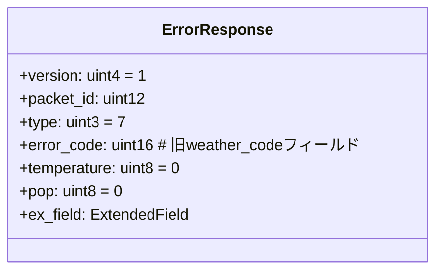
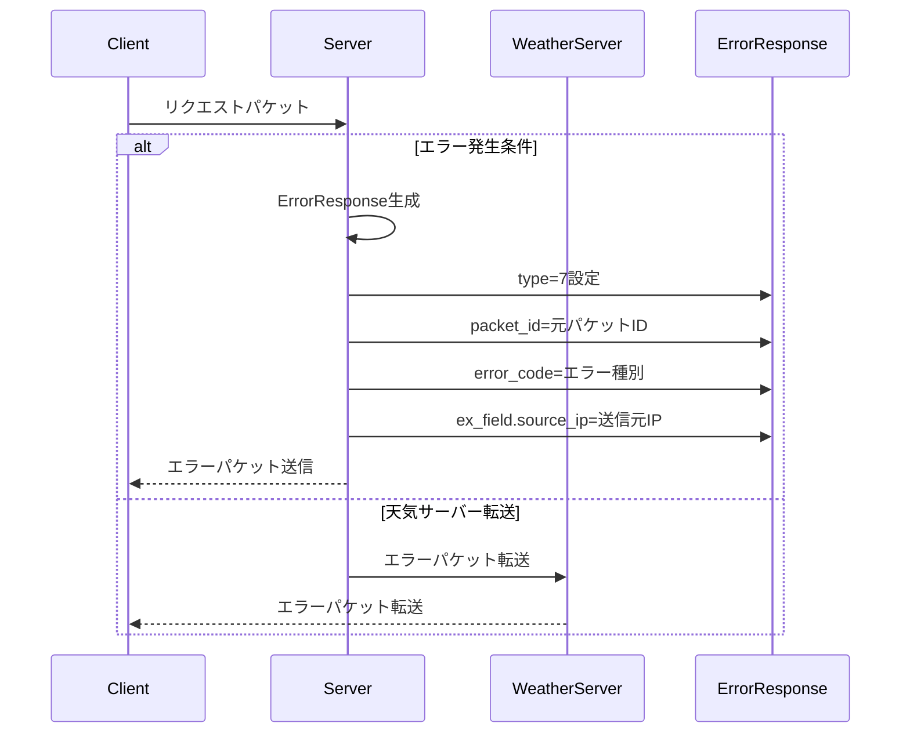

# エラーハンドリング機能 要件定義書

## 1. エラーパケット仕様
### 1.1 基本構造 (`common/packet/format_base.py`)


### フィールド詳細
| フィールド名   | ビット幅 | 値            | 説明 |
|----------------|----------|---------------|------|
| error_code     | 16       | エラーコード  | 旧weather_codeフィールドを転用 |
| ex_field       | 可変     | ソースIP      | 元パケットの送信元IPアドレス |

## 2. エラー処理フロー
### サーバー側処理 (`WIP_Server/servers/base_server.py`)


## 1.2 エラーコード定義
| コード | 値 | 発生条件 |
|--------|----|----------|
| 0x0001 | 1 | 無効なパケット形式 |
| 0x0002 | 2 | サポートされないパケットタイプ |
| 0x0003 | 3 | サーバー内部エラー |
| 0x0004 | 4 | リソース不足 |
| 0x0005 | 5 | タイムアウト |

## 1.3 ソースIPフォーマット
- IPv4アドレス (例: `192.168.1.1`)
- 文字列形式で格納
- 最大長: 15文字

## 1.4 パケット継承ルール
| フィールド | 継承元 | 必須 |
|------------|--------|------|
| packet_id | 元パケット | ○ |
| source_ip | ソケット情報 | ○ |
| version | 固定値(1) | ○ |

## 2. エラー処理フロー
### 2.1 基本フロー (`WIP_Server/servers/base_server.py`)
  ```python
  PACKET_TYPES = {
      0: "Request",
      1: "Response",
      2: "Query",
      3: "Location",
      7: "ErrorResponse"  # 追加
  }
  ```

### サーバーコア
- [ ] ベースサーバーエラーハンドリング拡張 (`WIP_Server/servers/base_server.py`)
  ```python
  def _handle_error(self, error_code, original_packet, addr):
      # ソースIP取得ロジック
      source_ip = addr[0] if isinstance(addr, tuple) else "0.0.0.0"
      
      err_pkt = ErrorResponse()
      err_pkt.packet_id = original_packet.packet_id
      err_pkt.error_code = error_code
      err_pkt.ex_field.set('source_ip', source_ip)
      self._send_to_client(err_pkt, addr)
  ```
  
### 2.2 例外ケース処理
- **ソースIP不明**: "0.0.0.0"を使用
- **パケットID欠如**: サーバーが新規ID生成
- **天気サーバー転送失敗**: エラーログ出力後破棄

### 3. 実装タスク
### 3.1 共通パケットモジュール
- [ ] `ErrorResponse`クラス実装 (`common/packet/error_response.py`)
- [ ] パケットタイプリスト更新 (`common/packet/__init__.py`)
  ```python
  def _handle_packet(self, data, addr):
      if packet.type == 7:  # エラーパケット
          self._send_to_client(packet, packet.ex_field['source_ip'])
  ```

## 4. テストケース
### 4.1 正常系テスト
1. エラーパケット生成テスト
   - タイプフィールド値=7確認
   - error_code値伝達テスト (0x0001-0x0005)
   - source_ip継承テスト (IPv4形式)

### 4.2 例外系テスト
1. ソースIP不明ケース ("0.0.0.0")
2. パケットID欠如時の自動生成
3. 天気サーバー転送失敗時のログ出力確認

2. サーバーエラーハンドリングテスト
   - 意図的エラー発生時のパケット送信確認
   - 天気サーバー経由のエラーパケット転送テスト