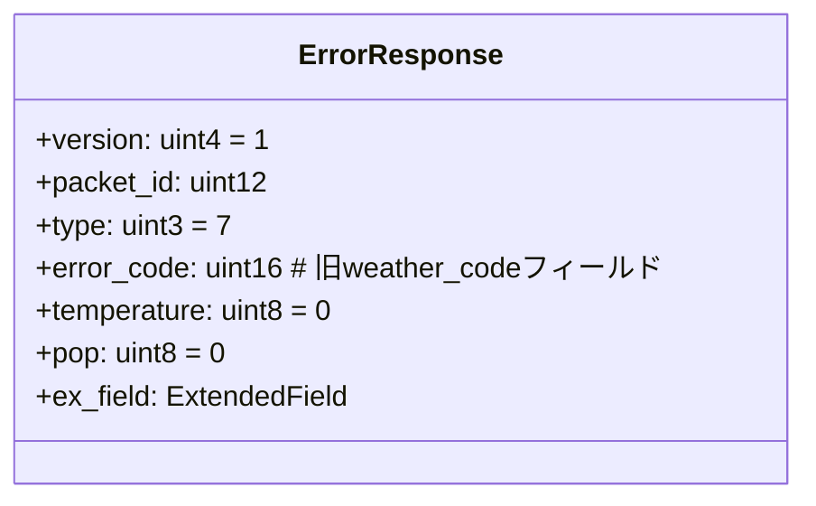
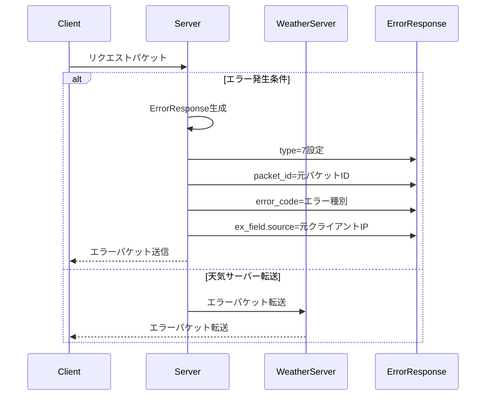
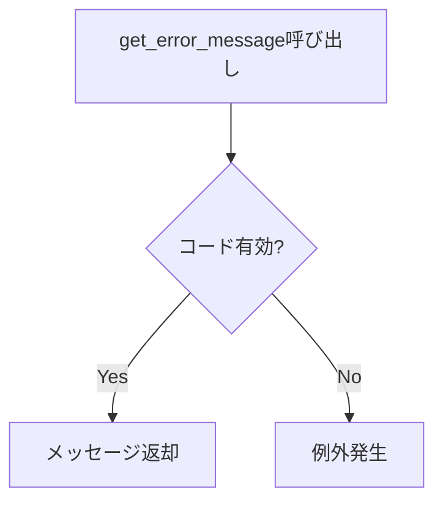

# エラーハンドリング仕様書

## 設計思想
- **即時フィードバック**: エラー発生時にクライアントに迅速に通知
- **最小限の情報**: エラーコードと発生源のみを含む
- **互換性維持**: 既存パケットフォーマットを再利用
- **トレーサビリティ**: ソースIPを含めることでエラー追跡を可能に


## 1. エラーパケット仕様
### 1.1 基本構造 (`common/packet/format_base.py`)

```mermaid
classDiagram
    class ErrorResponse {
        +version: uint4 = 1
        +packet_id: uint12
        +type: uint3 = 7
        +error_code: uint16  # 旧weather_codeフィールド
        +temperature: uint8 = 0
        +pop: uint8 = 0
        +ex_field: ExtendedField
    }
```

### フィールド詳細
| フィールド名   | ビット幅 | 値            | 説明 |
|----------------|----------|---------------|------|
| error_code     | 16       | エラーコード  | 旧weather_codeフィールドを転用 |
| ex_field       | 可変     | ソースIP      | 元パケットの送信元IPアドレス |

## 2. エラー処理フロー
### サーバー側処理 (`WIP_Server/servers/base_server.py`)

```mermaid
sequenceDiagram
    participant Client
    participant Server
    participant WeatherServer

    Client->>Server: リクエストパケット
    alt エラー発生条件
        Server->>Server: ErrorResponse生成
        Server->>ErrorResponse: type=7設定
        Server->>ErrorResponse: packet_id=元パケットID
        Server->>ErrorResponse: error_code=エラー種別
        Server->>ErrorResponse: ex_field.source=元クライアントIP
        Server-->>Client: エラーパケット送信
    else 天気サーバー転送
        Server->>WeatherServer: エラーパケット転送
        WeatherServer-->>Client: エラーパケット転送
    end
```

## 1.2 エラーコード体系
### 基本コード (0x0000-0x00FF)
| コード | 値 | 発生条件 | 推奨アクション |
|--------|----|----------|----------------|
| 0x0001 | 1 | 無効なパケット形式 | パケット形式を確認 |
| 0x0002 | 2 | サポートされないパケットタイプ | プロトコルバージョンを確認 |
| 0x0003 | 3 | サーバー内部エラー | ログを確認し再試行 |
| 0x0004 | 4 | リソース不足 | リソース解放後再試行 |
| 0x0005 | 5 | タイムアウト | ネットワーク状態を確認 |

### 拡張コード (256-1023)
- 256-511: 天気サーバー関連エラー
- 512-767: 位置情報サーバー関連エラー
- 768-1023: クエリサーバー関連エラー


## 1.3 ソースIPフォーマット
- IPv4アドレス (例: `192.168.1.1:12345`)
- 文字列形式で格納

## 1.4 パケット継承ルール
| フィールド | 継承元 | 必須 |
|------------|--------|------|
| packet_id | 元パケット | ○ |
| source_ip | ソケット情報 | ○ |
| version | 固定値(1) | ○ |

## 2. エラー処理フロー
### 2.1 基本フロー (`WIP_Server/servers/base_server.py`)
  ```python
  PACKET_TYPES = {
      0: "Request",
      1: "Response",
      2: "Query",
      3: "Location",
      7: "ErrorResponse"  # 追加
  }
  ```

### サーバーコア
- [ ] ベースサーバーエラーハンドリング拡張 (`WIP_Server/servers/base_server.py`)
  ```python
  def _handle_error(self, error_code, original_packet, addr):
      # ソースIP取得ロジック      
      err_pkt = ErrorResponse()
      err_pkt.packet_id = original_packet.packet_id
      err_pkt.error_code = error_code
      err_pkt.ex_field.source = original_packet.ex_field.source
      self._send_to_client(err_pkt, addr)
  ```
  
### 2.2 例外ケース処理
- **ソースIP不明**: "0.0.0.0"を使用
- **パケットID欠如**: サーバーが新規ID生成
- **天気サーバー転送失敗**: エラーログ出力後破棄

### 3. 実装タスク
### 3.1 共通パケットモジュール
- [ ] `ErrorResponse`クラス実装 (`common/packet/error_response.py`)
- [ ] パケットタイプリスト更新 (`common/packet/__init__.py`)
  ```python
  def _handle_packet(self, data, addr):
      if packet.type == 7:  # エラーパケット
          self._send_to_client(packet, packet.ex_field.source)
  ```

## 3. 使用方法とベストプラクティス
### 3.1 クライアント側実装
```python
from common.packet.error_response import ErrorResponse
from common.packet.exceptions import ErrorPacketException

try:
    # パケット処理
    response = process_packet(request)
    if response.type == 7:  # エラーパケット
        handle_error(response.error_code, response.ex_field.source)
except ErrorPacketException as e:
    # エラーパケット処理例外
    log_error(e)
```

### 3.2 サーバー側実装
```python
def handle_client_request(self, request, addr):
    try:
        # リクエスト処理
        return process_request(request)
    except Exception as e:
        error_code = self._map_exception_to_error_code(e)
        return self._create_error_response(request, error_code, addr)
```

### 3.3 例外処理ガイドライン
1. **クライアント側**:
   - エラーパケット受信時は即時処理
   - エラーコードに基づき適切な回復処理を実施
   - ソースIPをログに記録

2. **サーバー側**:
   - 例外発生時は適切なエラーコードにマッピング
   - 元パケットIDを保持
   - ソースIPを正確に設定

## 4. テストケース
### 4.1 正常系テスト
1. エラーパケット生成テスト
   - タイプフィールド値=7確認
   - error_code値伝達テスト (0x0001-0xFFFF)
   - source_ip継承テスト (IPv4/IPv6形式)


### 4.2 例外系テスト
1. ソースIP不明ケース ("0.0.0.0")
2. パケットID欠如時の自動生成
3. 天気サーバー転送失敗時のログ出力確認

2. サーバーエラーハンドリングテスト
   - 意図的エラー発生時のパケット送信確認
   - 天気サーバー経由のエラーパケット転送テスト

## 5. エラーコード管理方法
### 5.1 `error_code.json`の使用方法
- エラーコードとメッセージのマッピングをJSON形式で管理
- デフォルトパス: `./error_code.json`
- フォーマット例:
```json
{
  "000": "共通エラー: 無効なパケット形式",
  "001": "共通エラー: チェックサム不一致",
  "002": "共通エラー: サポートされないバージョン"
}
```

### 5.2 動的読み込みの仕組み
- `ErrorResponse`クラス初期化時に自動読み込み
- 手動読み込みも可能:
```python
ErrorResponse.load_error_codes()  # デフォルトパス
ErrorResponse.load_error_codes("custom/path/error_codes.json")  # カスタムパス
```

### 5.3 カスタムJSONパス指定方法
- `load_error_codes()`メソッドに絶対/相対パスを指定
- 例:
```python
# 相対パス指定
ErrorResponse.load_error_codes("../config/error_codes.json")

# 絶対パス指定
ErrorResponse.load_error_codes("/etc/app/error_codes.json")
```

## 6. エラーメッセージ取得方法
### 6.1 `get_error_message()`の使用例
- インスタンスメソッドとして利用:
```python
error_pkt = ErrorResponse()
error_pkt.error_code = 1  # エラーコード設定
message = error_pkt.get_error_message()  # "共通エラー: チェックサム不一致"
```

- 直接コード指定も可能:
```python
message = ErrorResponse().get_error_message("002")  # "共通エラー: サポートされないバージョン"
```

### 6.2 エラーコード検証の流れ
1. コードが3桁数字か確認
2. `error_code.json`に存在するコードか検証
3. 無効なコードの場合`InvalidErrorCodeException`を発生


```mermaid
flowchart TD
    A[get_error_message呼び出し] --> B{コード有効?}
    B -->|Yes| C[メッセージ返却]
    B -->|No| D[例外発生]
```