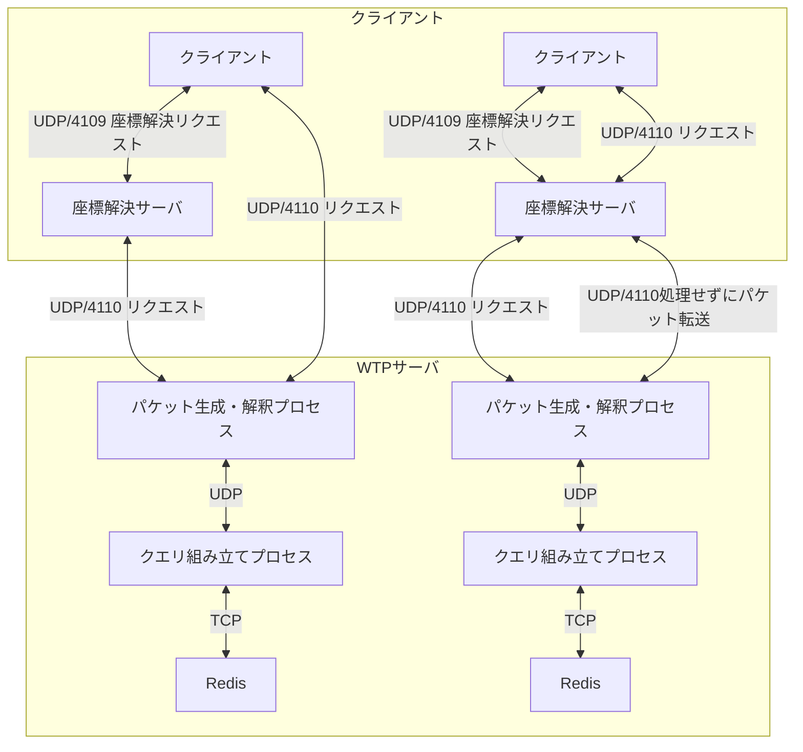

```mermaid
graph TD
    A <-->　|UDP/4109 座標解決リクエスト| B
    B <-->　|UDP/4110 リクエスト| E
    A <-->　|UDP/4110 リクエスト| E
    E <-->|UDP| C
    C <-->|TCP| D

    subgraph "クライアント"
        A[クライアント]
        B[座標解決サーバ]
    end

    subgraph "WTPサーバ"
        E[パケット生成・解釈プロセス]
        C[クエリ組み立てプロセス]
        D[Redis]
    end

    Z <-->　|UDP/4109 座標解決リクエスト| X
    X <-->　|UDP/4110 リクエスト| Y

    Z <-->　|UDP/4110 リクエスト| X
    X <-->　|UDP/4110処理せずにパケット転送| Y
    Y <-->|UDP| W
    W <-->|TCP| V

    subgraph "クライアント"
        Z[クライアント]
        X[座標解決サーバ]
    end

    subgraph "WTPサーバ"
        Y[パケット生成・解釈プロセス]
        W[クエリ組み立てプロセス]
        V[Redis]
    end

```
- 地域コードを既に取得している場合はWTPサーバへ直接通信
- 座標で取得する場合は座標解決サーバが代理リクエストを送信する形式